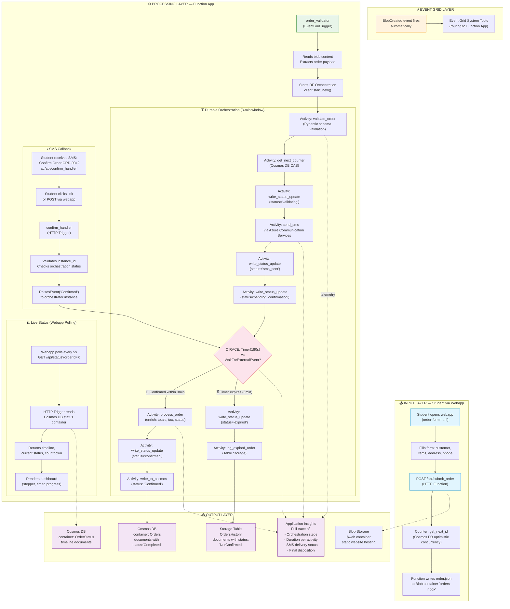

# 01 — Architecture Overview

## Complete Pipeline Fluxogram



## Component Responsibilities

| Component | Type | Trigger | Responsibility |
|---|---|---|---|
| `submit_order` | HTTP Trigger | `POST /api/submit_order` | Validate payload, get counter ID, write blob, return tracking info |
| `order_validator` | EventGrid Trigger | `BlobCreated` on `orders-inbox` | Read blob, start DF orchestration |
| `order_workflow` | DF Orchestrator | `start_new_orchestration` | Orchestrate the 8-step pipeline with timer/event race |
| `confirm_handler` | HTTP Trigger | `POST /api/confirm_handler` | Raise "Confirmed" event to orchestrator |
| `get_order_status` | HTTP Trigger | `GET /api/status` | Read status from Cosmos DB, return timeline + countdown |
| `validate_order` | Activity | Called by orchestrator | Pydantic schema validation |
| `get_next_counter` | Activity | Called by orchestrator | Atomic counter increment (CAS) |
| `send_sms` | Activity | Called by orchestrator | Send SMS via ACS (or simulated) |
| `write_status_update` | Activity | Called by orchestrator | Persist timeline entry to Cosmos DB |
| `process_order` | Activity | Called by orchestrator | Enrich with status, timestamps, totals |
| `write_to_cosmos` | Activity | Called by orchestrator | Write final order document |
| `log_expired_order` | Activity | Called by orchestrator | Write to Table Storage with `NotConfirmed` |

## Data Flow — Confirmed Path

```
1. Webapp POST → submit_order
2.   → Cosmos DB: counter.get_next_id() → displayId=42
3.   → Blob: orders-inbox/ORD-0042.json
4.   → Event Grid: BlobCreated
5.   → order_validator reads blob
6.   → DF orchestration starts (instance_id = ORD-0042-abc123)
7.   → validate_order (Pydantic)
8.   → get_next_counter (CAS retry)
9.   → write_status_update (validating)
10.  → send_sms (ACS)
11.  → write_status_update (sms_sent)
12.  → write_status_update (pending_confirmation, expiresAt)
13.  → RACE: Timer(180s) vs WaitForExternalEvent
14.  → Student clicks SMS link → POST /api/confirm_handler
15.  → RaiseEvent("Confirmed") → timer task wins
16.  → process_order (enrich)
17.  → write_status_update (confirmed)
18.  → write_to_cosmos (Orders container)
19.  → Webapp polls GET /api/status → sees "completed"
```

## Data Flow — Expired Path (Steps 1-13 same)

```
14.  → Timer expires (3 min)
15.  → write_status_update (expired)
16.  → log_expired_order (Table Storage: ExpiredOrders)
17.  → Webapp polls GET /api/status → sees "expired"
```

## Azure Resources (One Resource Group)

| Resource | SKU | Purpose |
|---|---|---|
| Storage Account | Standard_LRS | Blob containers, Tables, Static website |
| Event Grid System Topic | Standard | Route BlobCreated events to Function |
| Function App | Consumption (Y1) | All triggers + DF orchestration |
| Cosmos DB | Free Tier (Serverless) | Orders, Counter, Status containers |
| App Insights | Basic | Telemetry + distributed tracing |
| ACS | Free Tier | SMS delivery |

## RBAC Roles (System-assigned Managed Identity)

| Identity | Scope | Role |
|---|---|---|
| Function App MI | Storage Account | Storage Blob Data Contributor |
| Function App MI | Storage Account | Storage Table Data Contributor |
| Function App MI | Cosmos DB | Cosmos DB Built-in Data Contributor |
| Function App MI | ACS | ACS SMS Sender |
| Function App MI | App Insights | Monitoring Metrics Publisher |
